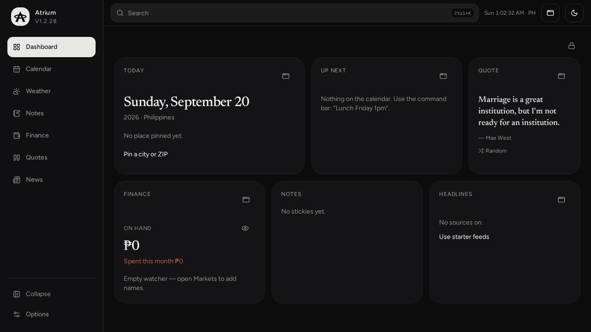
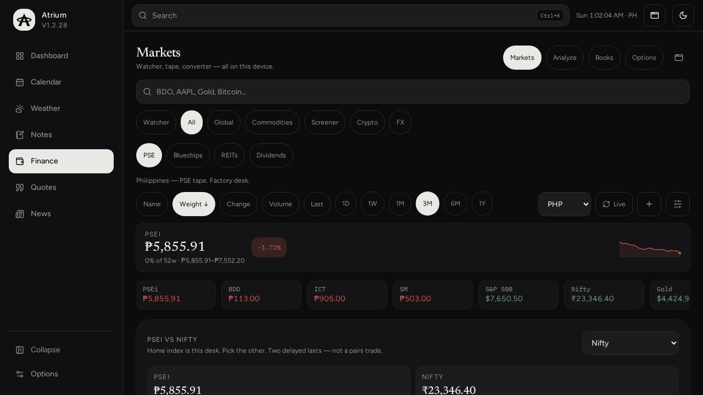
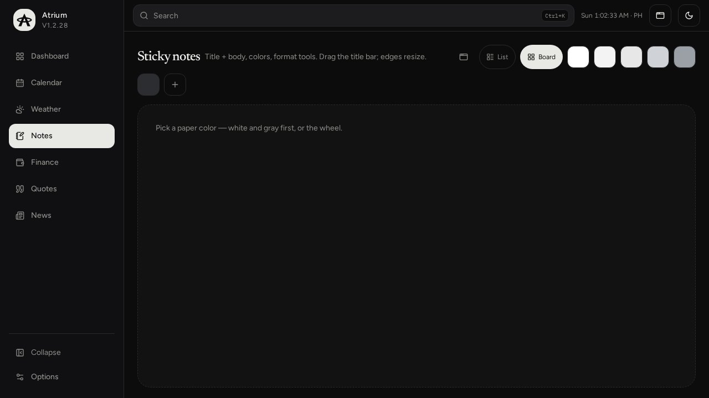
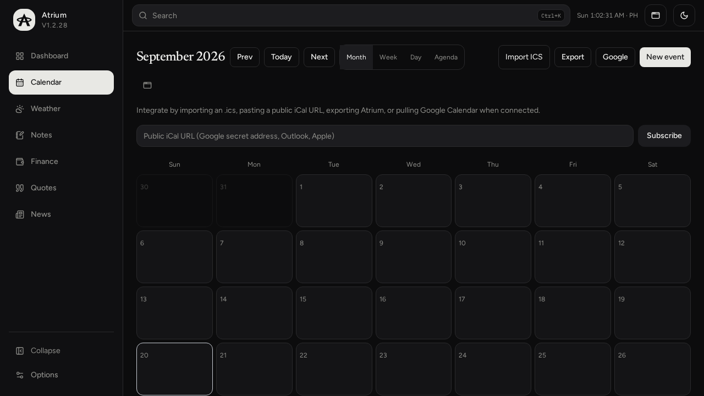
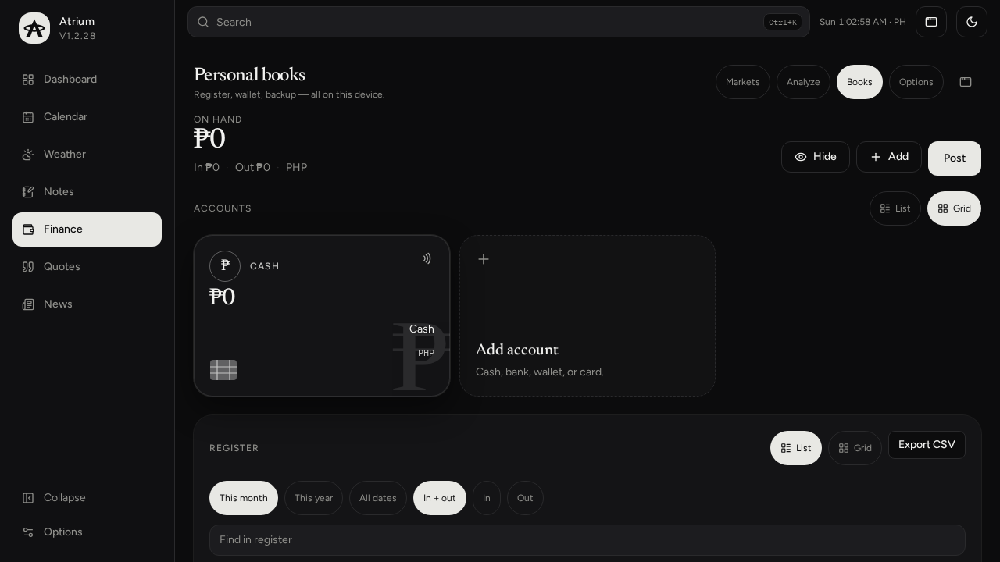

# Atrium

Personal command center. Times and quotes are Asia/Manila. Data stays on this device (`atrium.v1`).

**Version 1.2.28**

## Look







## Use

- Command bar: type to search the desk — `BDO`, `ayala`, `note: buy rice`, `Lunch Friday 1pm`, `weather` (`⌘K` on Mac, `Ctrl+K` elsewhere)
- Dashboard: locked by default. Unlock to drag cards or cycle width. Reset restores the factory layout. Today is a glance — pin a city on the Weather tab
- Weather: dedicated tab for city or ZIP and Use my location. AccuWeather-style board — RealFeel, UV, US AQI, sunrise/sunset, hourly, 7-day. No map. Toggle the module in Options. ZIP 10001 is New York even on a Philippines desk
- Calendar: Month / Week / Day / Agenda. Floating calendar is adaptive (month + day when roomy, compact when tight) with a remembered Auto / Month / Compact toggle
- Finance: Markets first (official PSEi 30, Yahoo PSEi index last, official free-float weights from First Metro's public file, Yahoo screener plus a PSEi 30 screen on the public-tape seed, sparks, research PDF with an Expert take) and Books (cash, bank, wallet, card). All follows the desk region in Options — Philippines is the factory PSE tape; US / HK / India / others load that market's liquid names plus Yahoo most-actives and local headlines. Bluechips / REITs / Dividends stay Philippine. Index compare is the desk's home index against a picker (Philippines starts PSEi vs Nifty; US vs Nasdaq; HK vs Nikkei). Two delayed lasts, not a pairs trade. Correlation is Pearson r and OLS β on real sparks only. Session rotation ranks official PSEi 30 sleeves (Banks are the four index names BDO / BPI / MBT / CBC, not the broader PSE financials). Open a sleeve to list every name — it does not jump to one quote. Watcher name traps flag dual listings, group sleeves, and short-ticker mix-ups, including a one-line hint on the board row. Yahoo sparks for the index and global last backfill the local tape so PSEi β can survive a refresh. Books off hides cash on the dashboard Finance card and the float. Both follow the Cash tabs switches — watcher list when Markets is on, cash when Books is on — with no extra chips. Daily digest keeps the last 10 RSS runs per region. Analyze is a user-clicked CFA take (never on open). All / bluechips default to PSEi weight, not raw % change. Heat is the PSEi 30 by weight on a PH desk, session % on others. Movers (gainers / losers / active) sit on All, Bluechips, and Crypto; crypto movers use 24h volume. The PSEi board shows public-tape PE / P/B / yield (seed 18 Sep 2026, sheet refreshes live). Open a ticker and the sheet leads with a CFA desk (public-tape PE / P/B / yield when Yahoo is empty, 52-week change / SMA50 / RSI / typical volume from the same tape, last-reported bank ROE / NIM / NPL / CET1 with an age-out after the next 17-Q window, a labeled justified P/B identity, PSEi weight, spark range when 52w is missing, tape, honest gaps — not a DCF or a target). Research PDF paginates and stays open in the sheet. Bank and REIT sheets add a relative-value sleeve. ICT TTM ROE/P/B is flagged as a StockAnalysis distortion — not haircut. Then Facts vs Rumors matched to the legal name and symbol (BDO is Banco de Oro / BDO Unibank, not Luxembourg or biomass; ICT is ICTSI, not the ICT ministry). Daily first: facts from the last two weeks, talk from the last 30 days; older copy is Earlier, not Latest (Bilyonaryo, Politiko, Abante, InsiderPH, Manila Times, Philstar, “in talks”). Announced bond “eyeing” stays Facts. Credit-card ads and chart pages stay off the desk. Add any name from the plus button or the star on a row — star is the watcher, there is no second starred list. Stock tape in Options: Auto and Yahoo both keep PSE last on this desk — Yahoo dropped .PS listings and is never asked for SM, BDO, or ICT, so NYSE SM Energy cannot land on a Philippine strip
- Quotes: optional module. Topic chips, live search, Exact author toggle. Live public lines, shuffled on Random — desk copies only if the feed is empty
- Notes: Windows Sticky Notes baseline — colored pads, title + body, new/delete/color, list + board, pin to float — plus format (B/I/U/S/bullets/checklist), pictures, pencil with undo. Checklist is a list in the body, same as bullets — type, Enter for the next line, tap the box to mark done. Float, color, and delete sit on the title bar and only appear when the pointer is near (always on a phone). Color is a clamped palette plus an HSL pad — no system color wheel. Delete asks first. Windows menu Notes Open floats every pad on a 3-col grid, Close unpins them — same as Weather
- News: tagged briefing with search. Sources start off — tap Use starter feeds, or pick outlets. Whatever you leave on is restored next open
- Sidebar: collapse, then Options. Version sits under the mark. Toggle modules in Options
- Profile: name starts blank. Pin a city or ZIP (type-ahead) on the Weather tab or in Options. Backup / restore / delete the whole desk from Options
- Floating desk: pin notes and widgets over any screen. The window icon is icon-only — hover for Float / On desk. The header Windows menu lists Weather, Calendar, Notes, Quote, Finance, News. Notes Open floats all pads. Close and reopen and they return where you left them (separate last-size on a phone). Title bar and close stay on-screen; snap to edges; Bring windows home in the desk menu. Esc still closes. Switching sidebar tabs does not pop floats in front. On Windows, closing an OS window saves its last box

## Install / deploy (native)

Tauri 2 wrap of the Vite app. Icon is a sharp chevron + ring (Windows, Android, and home-screen).

### Windows (NSIS)

```bat
deploy.bat
```

Needs Node 22+, Rust, WebView2. Output: `deploy/windows/*-setup.exe`.

Preferred layout on Eric’s PC:

- Source: `C:\Users\Eric\Desktop\Vibe Apps\Atrium\Source`
- Installers: `C:\Users\Eric\Desktop\Vibe Apps\Atrium\Installers\Windows`

### Android (arm64 APK)

```bat
apk.bat
```

Needs Microsoft JDK 17, Android SDK (`%LOCALAPPDATA%\Android\Sdk`), NDK, Rust `aarch64-linux-android`. Output: `deploy/android/atrium-v1.2.28-arm64-release.apk`.

### Dev

```bash
npm install
npm run dev          # Vite PWA
npm run desktop      # Tauri window
npm run typecheck
npm test
```

Heavy modules (Finance / News / Quotes) load on demand for a faster first paint.

Created with Grok.
