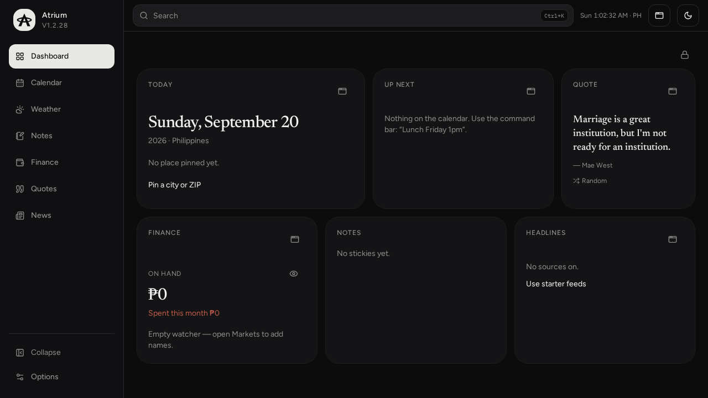
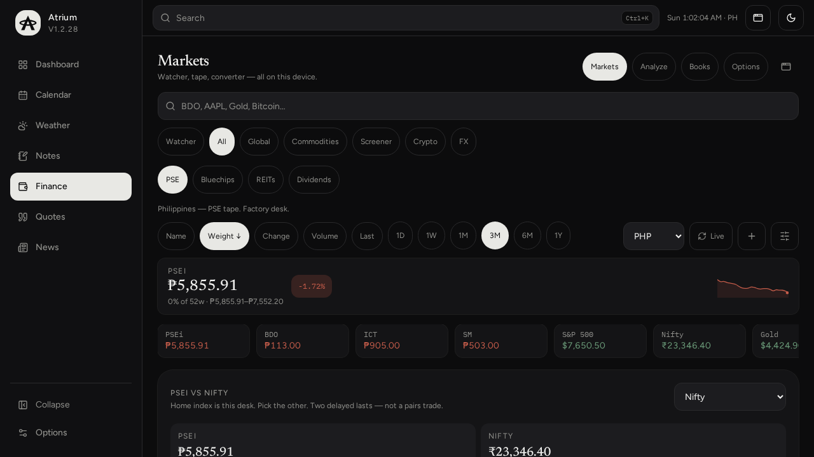
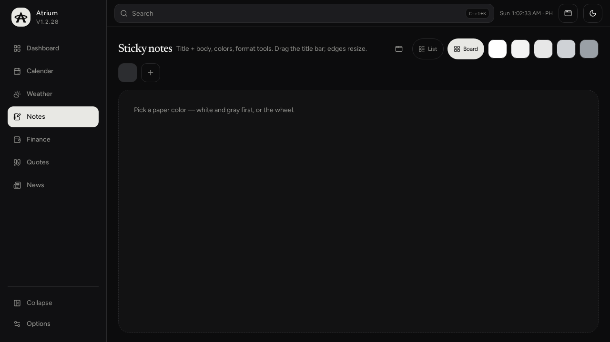
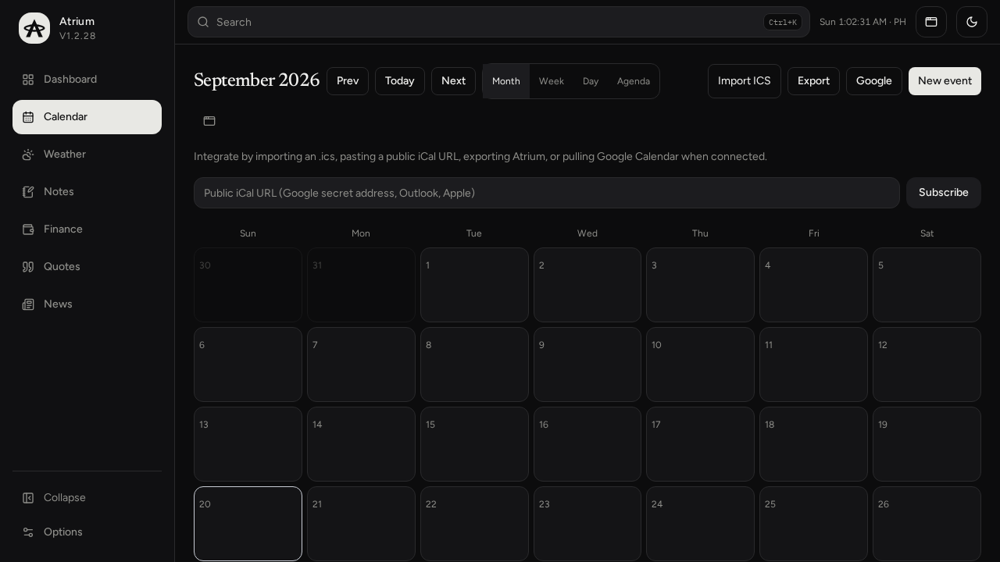
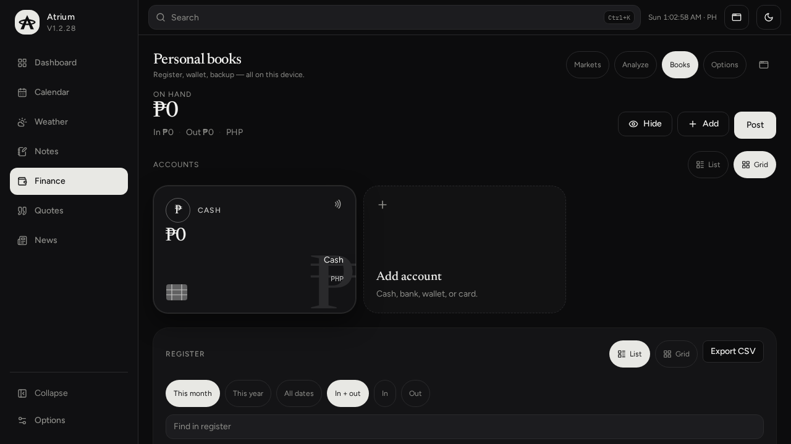

# Atrium

Personal command center. Clock, tape currency, and market books are separate settings. Data stays on this device (`atrium.v1`).

**Version 1.2.46**

## Look







## Use

- Command bar: type to search the desk — `BDO`, `ayala`, `note: buy rice`, `Lunch Friday 1pm`, `weather` (`⌘K` on Mac, `Ctrl+K` elsewhere)
- Dashboard: locked by default. Unlock to drag cards or cycle width. Reset restores the factory layout. Today is a glance — pin a city on the Weather tab
- Weather: dedicated tab for city or ZIP and Use my location. AccuWeather-style board — RealFeel, UV, US AQI, sunrise/sunset, hourly, 7-day. No map. Toggle the module in Options. ZIP 10001 is New York even on a Philippines desk
- Calendar: Month / Week / Day / Agenda. The grid and a fresh demo week use the clock timezone, not a fixed Manila offset. On a phone the month shows the first event and how many more; that count opens the day. The day number is a full tap target. Floating calendar is adaptive (month + day when roomy, compact when tight) with a remembered Auto / Month / Compact toggle. Google pull lists calendars — Mine stays on, Family and holidays start hidden. The pull uses the clock’s month, not UTC midnight, and says when Google cut the list short. A desk event can repeat daily, weekly, monthly, or yearly. Leave until and count empty and it repeats forever — a birthday is one yearly rule, not a copy per year. 31 January stays in February instead of spilling into March. Skip one date without deleting the series. Google birthdays, including a Contacts calendar, start on. Family and holidays stay hidden. A Google row says it was pulled; an edit stays on this desk and is not written back. Changing month pulls the calendars left on.
- Finance: Markets first (official PSEi 30, Yahoo PSEi index last, official free-float weights from First Metro's public file, Yahoo screener plus a PSEi 30 screen on the public-tape seed, sparks, research PDF with an Expert take) and Books (cash, bank, wallet, card). All follows the market chips you turn on, several countries at once. Clock, tape currency, and those chips stay independent. Philippines is only the factory book. Vietnam, Thailand, Malaysia, Indonesia, Korea, Taiwan, and the other liquid desks load that market's names plus Yahoo most-actives. US / HK / India stay first-class. PSEi 30, PSE REITs, and PSE Dividends show only when Philippines is an open book. Index compare lets you pick both sides — Nasdaq against Nifty, or any other pair. An empty left side follows the first open book until you choose. Two delayed lasts, not a pairs trade. The index strip above the tape is the left side of that pair, not the first book's home. Correlation is Pearson r and OLS β on real sparks only. Session rotation ranks official PSEi 30 sleeves (Banks are the four index names BDO / BPI / MBT / CBC, not the broader PSE financials). Open a sleeve to list every name — it does not jump to one quote. Yahoo sparks for the index and global last backfill the local tape so PSEi β can survive a refresh. Books off hides cash on the dashboard Finance card and the float. Both follow the Cash tabs switches — watcher list when Markets is on, cash when Books is on — with no extra chips. Daily digest keeps the last 10 RSS runs per region. All defaults to PSEi weight only when Philippines is open; otherwise % change. Heat is the PSEi 30 by weight on a PH desk, session % on others. Movers (gainers / losers / active) sit on All, Bluechips, and Crypto; crypto movers use 24h volume. The PSEi board shows public-tape PE / P/B / yield (seed 18 Sep 2026, sheet refreshes live). Open a ticker and the sheet leads with a CFA desk (public-tape PE / P/B / yield when Yahoo is empty, 52-week change / SMA50 / RSI / typical volume from the same tape, last-reported bank ROE / NIM / NPL / CET1 with an age-out after the next 17-Q window, a labeled justified P/B identity, PSEi weight, spark range when 52w is missing, tape, honest gaps — not a DCF or a target). Research PDF paginates and stays open in the sheet. Bank and REIT sheets add a relative-value sleeve. ICT TTM ROE/P/B is flagged as a StockAnalysis distortion — not haircut. Then Facts vs Rumors sit under the last, for every book, on that market’s wires. A bare ticker that is not on the PSE book uses its own market — AAPL is Reuters even when saved as a stock; `.VN` is VnExpress; BDO stays Bilyonaryo. A 3-letter US ticker is not dropped for lacking Manila. Peso is added to an FX search only when the pair is PHP. The board row names the wires; opening the name loads the stories. An empty talk lane names who was asked. Opening the same name again within ten minutes reuses that harvest. A wire that didn’t answer is not cached, so the next open asks again. A harvest older than ten minutes is dropped, and the desk keeps at most 64 names. Daily first: facts from the last two weeks, talk from the last 30 days; older copy is Earlier, not Latest (Bilyonaryo, Politiko, Abante, InsiderPH, Manila Times, Philstar, “in talks”). Announced bond “eyeing” stays Facts. Credit-card ads and chart pages stay off the desk. Add any name from the plus button or the star on a row — star is the watcher, there is no second starred list. Stock tape in Options: Auto and Yahoo both keep PSE last on this desk — Yahoo dropped .PS listings and is never asked for SM, BDO, or ICT, so NYSE SM Energy cannot land on a Philippine strip. If FX, Yahoo, the Philippine tape, crypto, or a screener doesn’t answer, the board names it instead of looking complete. A full browser says so once — export a backup from Options. The quote sheet, currency converter, board settings, wallet cards, and the transaction dialog are separate pieces of the same screens.
- Quotes: optional module. Defaults to Popular. Topic chips, live search, Exact author toggle. Live public lines, shuffled on Random — desk copies only if the feed is empty
- Notes: Windows Sticky Notes baseline — colored pads, title + body, new/delete/color, list + board, pin to float — plus format (B/I/U/S/bullets/checklist), pictures, pencil with undo. Checklist is a list in the body, same as bullets — type, Enter for the next line, tap the box to mark done. The board is a scrollable grid. Drag a title to reorder. Pin still floats. The format bar stays on the card so it does not cover the drag. Unpin returns a pad to the grid. Float, color, and delete sit on the title bar and only appear when the pointer is near (always on a phone). Color is a clamped palette plus an HSL pad — no system color wheel. Delete asks first. Windows menu Notes Open tiles pads across the whole desk so closing one leaves room; Close unpins them — same as Weather
- News: chips are the feed’s own section. A country desk with an explicit region and a World section chips as that country — Vietnam stays Vietnam; BBC World stays World. The source line adds that desk when it is not the section. Titles are not scanned. Filter chips are only the tags in this briefing. Sources start off — Use starter feeds turns on BBC plus the pack for the first open book. Remove a source and it stays gone; turning the pack back on restores it. A source that doesn’t answer is named; the rest of the briefing stays.
- Sidebar: collapse, then Options. Version sits under the mark. Toggle modules in Options
- Profile: name starts blank. Pin a city or ZIP (type-ahead) on the Weather tab or in Options. Backup / restore / delete the whole desk from Options
- Floating desk: pin notes and widgets over any screen. The window icon is icon-only — hover for Float / On desk. The header Windows menu lists Weather, Calendar, Notes, Quote, Finance, News. Notes Open floats all pads. Close and reopen and they return where you left them (separate last-size on a phone). Title bar and close stay on-screen; snap to edges; Bring windows home in the desk menu. Esc still closes. Switching sidebar tabs does not pop floats in front. On Windows, closing the main window closes child floats and saves their last boxes so the next open restores them

## Install / deploy (native)

Tauri 2 wrap of the Vite app. Icon is a sharp chevron + ring (Windows, Android, and home-screen).

GitHub Actions runs the typecheck and the tests on Node 22. The Vercel build and the server function both use Node 22. Destructive buttons and card text clear 4.5:1. The `*.vercel.app` addresses stay behind Vercel sign-in.

### Windows (NSIS)

```bat
deploy.bat
```

Needs Node 22+, Rust, WebView2. Output: `deploy/windows/*-setup.exe`.

Preferred layout on Eric’s PC:

- Source: `C:\Users\Eric\Desktop\Vibe Apps\Atrium\Source`
- Installers: `C:\Users\Eric\Desktop\Vibe Apps\Atrium\Installers\Windows`

### Android (arm64 APK)

```bat
apk.bat
```

Needs Microsoft JDK 17, Android SDK (`%LOCALAPPDATA%\Android\Sdk`), NDK, Rust `aarch64-linux-android`. Output follows package.json: `deploy/android/atrium-arm64-release.apk` and `deploy/android/atrium-v1.2.46-arm64-release.apk`.

### Dev

```bash
npm install
npm run dev          # Vite PWA
npm run desktop      # Tauri window
npm run typecheck
npm test
```

Heavy modules (Finance / News / Quotes) load on demand for a faster first paint.

Created with Grok.
